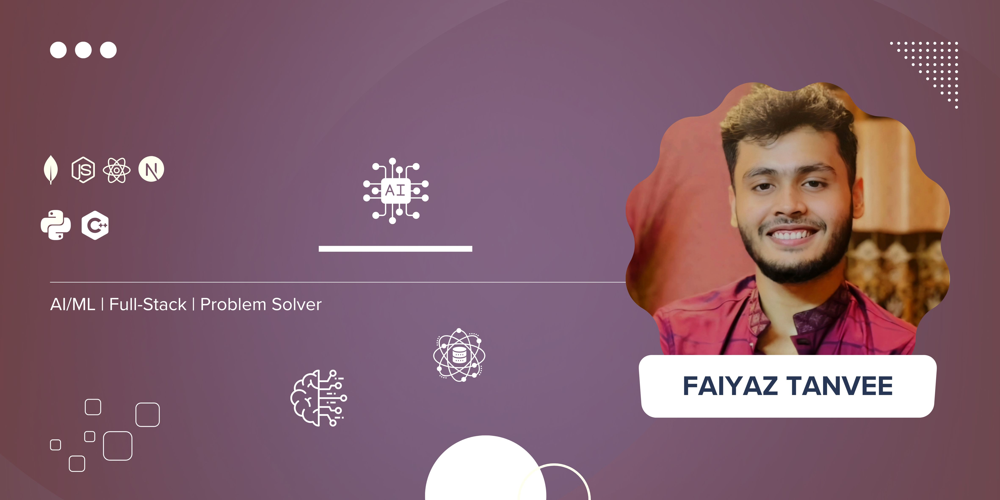

  

<h1 align="center">Hello There, I am Faiyaz Tanvee</h1>

  I am an AI Enthusiast and Full-Stack Developer based in Dhaka, Bangladesh, currently doing B.Sc. in Computer Science from BUBT. My goal is to build intelligent systems with a strong foundation in MERN stack development, allowing me to create and deploy end-to-end applications.

 

<h2 align="center">My Core Philosophy</h2>

  <b>I am confident in my ability to complete a task within a given timeline, even if the required technology is new to me. I work on it, seek out knowledge, and self-learn the necessary tools and concepts. I am resourceful and always committed to applying my best effort to deliver results.</b>

 

<h2 align="center">Technical Skills</h2>

  <strong>Programming Languages</strong> 
  

  <strong>Full-Stack Development (MERN)</strong> 
  

  <strong>Tools & Technologies</strong> 
  
  
  

 

<h2 align="center">GitHub Statistics</h2>

  
  

 

<h2 align="center">Current Focus</h2>

  <ul style="list-style-type: none; padding-left: 0;">
    <li style="margin-bottom: 10px;">🎯 &nbsp; Actively seeking a remote internship or full-time role in <strong>MERN Stack Development</strong> to contribute to building robust web applications.</li>
    <li style="margin-bottom: 10px;">📚 &nbsp; Expanding my expertise in <strong>Machine Learning</strong> and <strong>Data Science</strong> through self-study and hands-on projects.</li>
    <li style="margin-bottom: 10px;">💻 &nbsp; Consistently trying to make time to solve problems on <strong>LeetCode</strong> to strengthen my foundation in Data Structures and Algorithms.</li>
  </ul>

 

<h2 align="center">Contact Information</h2>

  
  
  

